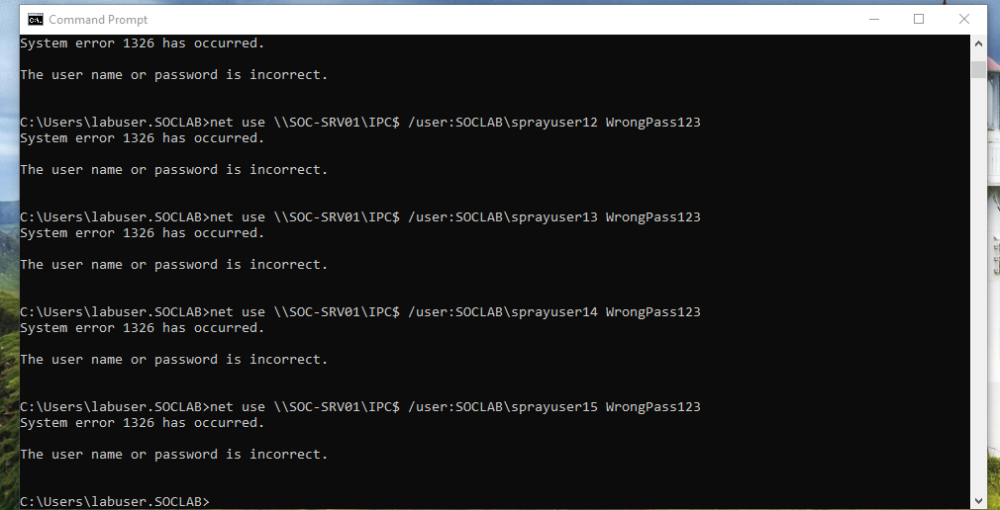
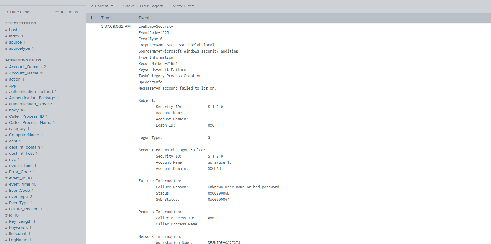
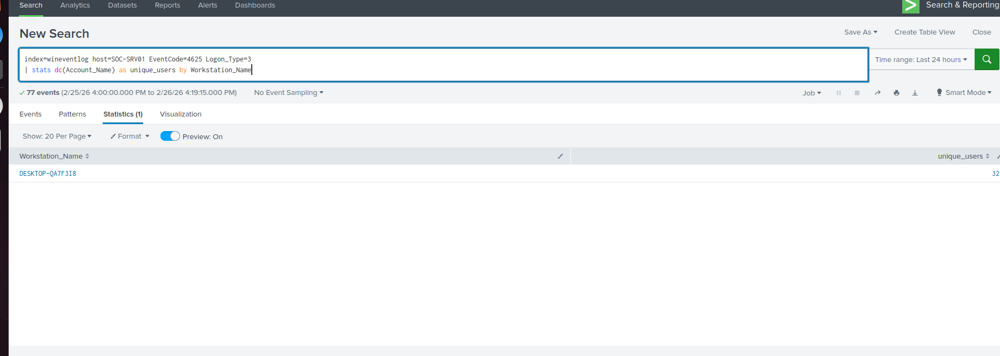
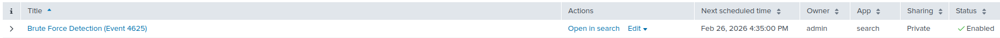

# Active Directory Password Spraying Detection Lab

## Overview
This project simulates a password spraying attack against an Active Directory domain and detects it using Splunk.

## Lab Environment
- Windows 10 (Domain Joined)
- Windows Server (Domain Controller - SOC-SRV01)
- Splunk Enterprise
- Splunk Universal Forwarder
- VirtualBox Host-Only Network

## Attack Simulation
Simulated password spraying using repeated failed SMB authentication attempts.

## Attack Execution

The following command was used to simulate a password spraying attack against the Domain Controller:

```cmd
for /L %i in (1,1,15) do net use \\SOC-SRV01\IPC$ /user:SOCLAB\sprayuser%i WrongPass123
```



## Failed Logon Events (Event ID 4625)

The simulated password spray generated multiple failed network authentication events (Event ID 4625) on the Domain Controller.



## Detection Query

To detect password spraying behavior, distinct failed usernames were counted per workstation:

```spl
index=wineventlog host=SOC-SRV01 EventCode=4625 Logon_Type=3
| stats dc(Account_Name) as unique_users by Workstation_Name
```

The query identifies a high number of unique failed logon attempts originating from a single workstation.



## Alert Configuration

A scheduled Splunk alert was created to detect password spraying activity when more than 10 unique failed network logons (Event ID 4625) occur from a single workstation.

```spl
index=wineventlog host=SOC-SRV01 EventCode=4625 Logon_Type=3
| stats dc(Account_Name) as unique_users by Workstation_Name
| where unique_users > 10
```





## Detection Strategy
Detected abnormal volume of failed network logons across multiple user accounts from a single workstation.

## MITRE ATT&CK Mapping
T1110.003 – Password Spraying

---
Screenshots and detection details below.
